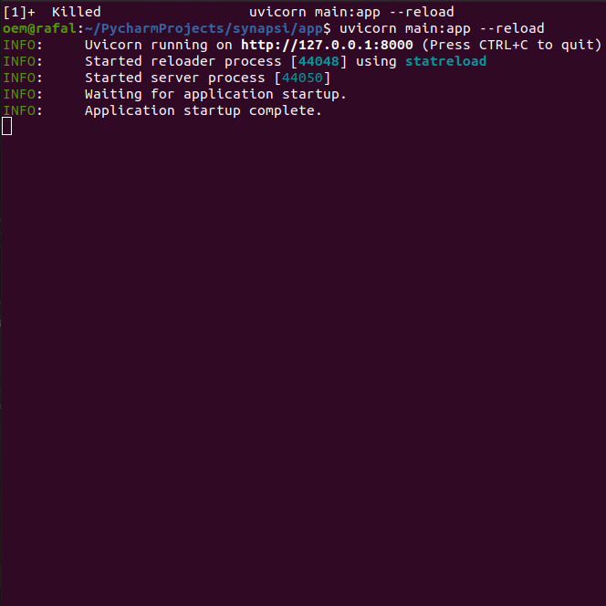
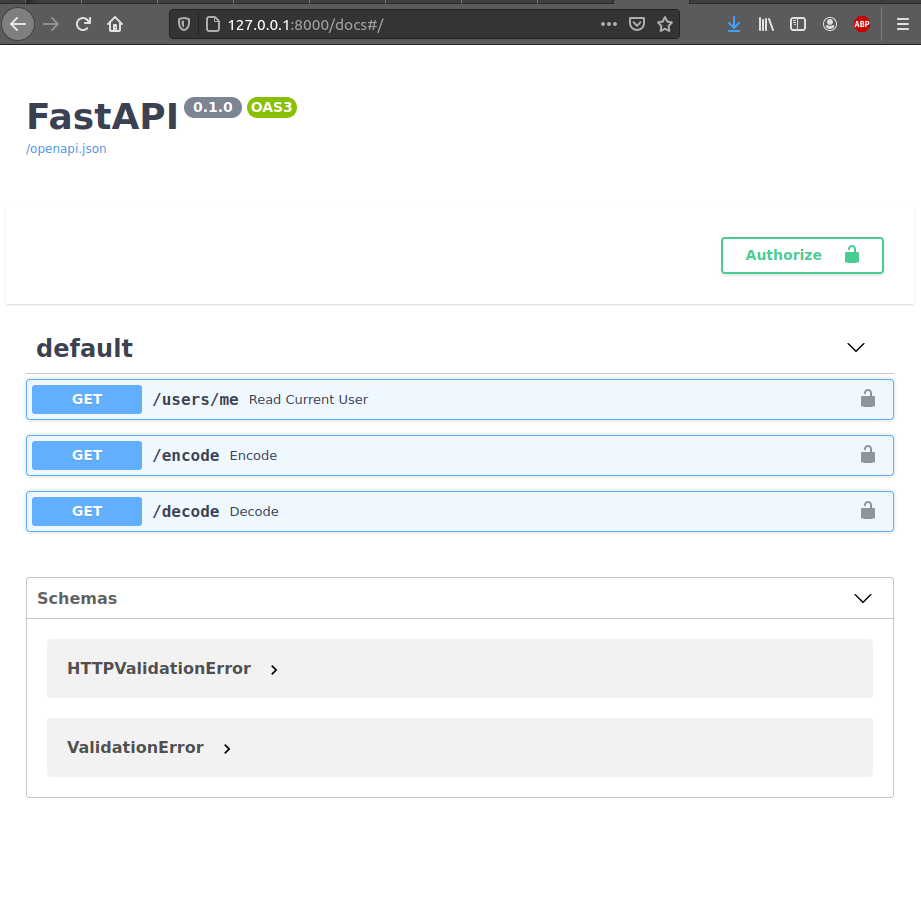
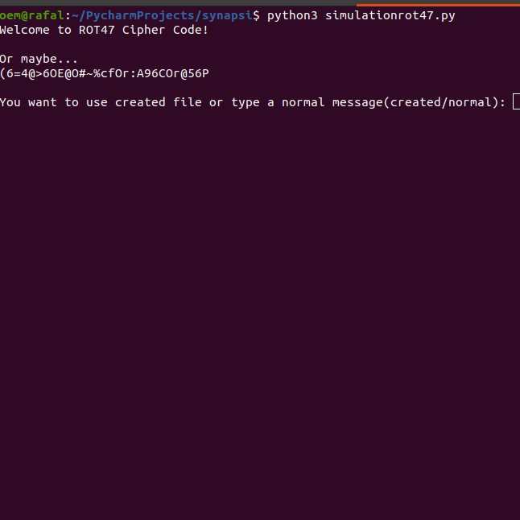

# IMPLEMENTATION ROT47 - script
Simple cipher implemented using Python, with server FastAPI, and containerized by Docker.
### Table of Contents
* General info
* Technologies
* Setup
* Using
* How to use it

## General info
The goal of this project was to implement any cipher using Python.
The project includes a few functions, which we use them to encode or decode simple text or from created files.
I coded this cipher as my recruitment task to get the job.

## Technologies
* Python 3.8
* Fast-API
* Uvicorn 0.13.4 
* Docker 20.10.6

## Setup
*Terminal setup

*PyCharm

*FastAPI

###Terminal setup
To run this project, open your terminal, go to folder with your file, then type:

```
$ python3 simulationrot47.py
```


###Pycharm
To run app using PyCharm, simply open your PyCharm with 'simulationrot47.py' file, then press 'Run',
or run it by using keyboard shortcut Shift+F10


###FastAPI
Here we have more to do.In this case we need use 'main.py'. First, start with finding our app. Go to your app, and open Terminal.
After that, we need to install FastAPI, Uvicorn and Pydantic. Let's do this using these commands: 

FastAPI
```
$ pip3 install fastapi
```

Uvicorn
```
$ pip3 install uvicorn
```

Pydantic
```
$ pip3 install pydantic
```

Now, when we have all of these packages. We are able to run our server, by using this command.

```
$ uvicorn main:app --realod
```

It should looks similiar to that: 


Next thing we are going to do is open our server in web browser. Just, enter this URL:
http://127.0.0.1:8000/docs#/

It will look like:


##Using 

###Terminal

We can see: 



And our application leads our throught the whole process...

###PyCharm

It is the same situation like with Terminal....


###FastAPI 

And then we can click on '/encode', and 'Try it out'.

In the Description field we write anything we want, but, and it is important
the key must be set to 47, otherwise our app won't run.

The same situation we have with '/decode', of course with key == 47.

###Docker 
Afterward, we can set our application into the Docker.

To do this we need to using this command: 

```
$ sudo docker-compose up --build
```
```
$ docker run -d --name mycontainer -p 80:80 myimage
```

## Code Examples

Before:

Give me a chance, and see if I am able to encode your text

After: v:G6O>6O2O492?46[O2?5OD66O:7OxO2>O23=6OE@O6?4@56OJ@FCOE6IE


##END
This is it, all steps to run our application.

##Author

I hope you have fun with it, if you want to send me any advices or questions send it here:

mr.rafalwilk@gmail.com

My website:
wilkrafal.work

LinkedIn:
https://www.linkedin.com/in/wilk-rafa%C5%82-964ba8206/


